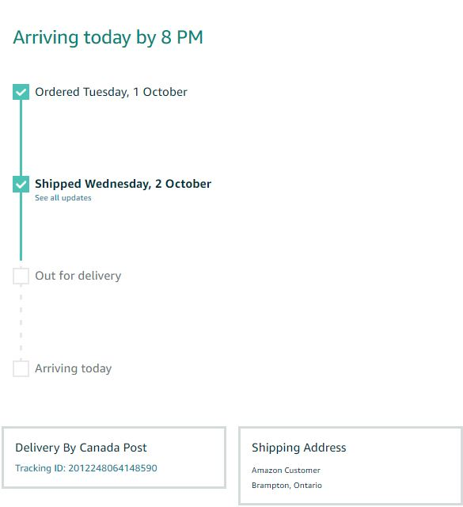
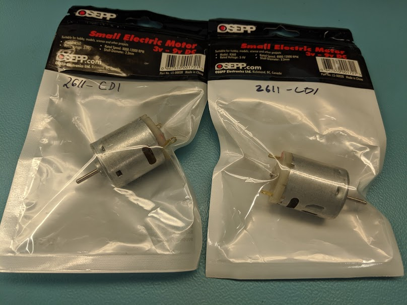
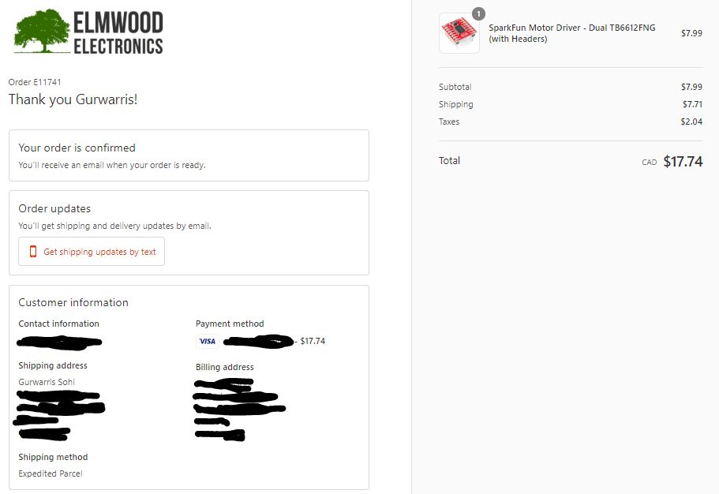

Gurwarris's Team.
-------------
### September 26, 2019
Proof of Purcahse
My Raspberry Pi 4 Model B is Arriving Today.

I have already acquired Model R360 DC motors

I have ordered the Sparkfun Dual Motor Driver

### September 26, 2019
Today I completed my [Budget](https://github.com/Warris-Sohi/SmartTennisBallMachine/blob/master/Documentation/Project%20Budget.pdf) 

### September 19, 2019

Created [project schedule](https://github.com/Warris-Sohi/SmartTennisBallMachine/blob/master/Documentation/ScheduleCapstone%20Project.pdf).  
### September 12, 2019

Created [proposal](https://github.com/Warris-Sohi/SmartTennisBallMachine/blob/master/Documentation/ProposalContentGurwarrisSohiSmartTennisBallMachine.docx).

### September 5, 2019

Created [repository](https://github.com/Warris-Sohi/SmartTennisBallMachine).
